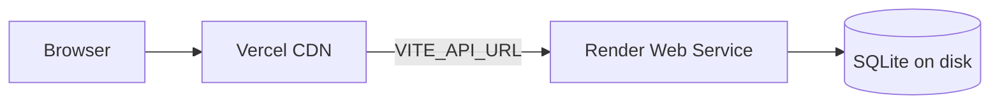

# Deploy UXguard (Vercel + Render)

## Architecture



| Layer | Host | Path |
|-------|------|------|
| Frontend | **Vercel** | `frontend/` |
| Backend API | **Render** | `backend/` (Docker) |

---

## Step 1 — Push to GitHub

```bash
git push origin main
```

Repo: `romscp-afk/uxguard-portfolio`

---

## Step 2 — Deploy backend (Render)

1. Open [Render Dashboard](https://dashboard.render.com) → **New** → **Blueprint**
2. Connect repo `romscp-afk/uxguard-portfolio`
3. Set **Blueprint Path** to `infrastructure/render.yaml`
4. Deploy and copy the service URL (e.g. `https://uxguard-portfolio-api.onrender.com`)
5. In Render → **Environment**, set:

   | Variable | Value |
   |----------|-------|
   | `CORS_ORIGINS` | `https://YOUR-VERCEL-URL.vercel.app` |

6. Verify: `curl https://YOUR-API.onrender.com/health`

Demo login (auto-seeded): `demo@uxguard.io` / `demo1234`

---

## Step 3 — Deploy frontend (Vercel)

### Option A — GitHub integration (recommended)

1. Open [vercel.com/new](https://vercel.com/new) → import `romscp-afk/uxguard-portfolio`
2. Set **Root Directory** to `frontend`
3. Framework: **Vite** (auto-detected)
4. Add environment variable:

   | Name | Value |
   |------|-------|
   | `VITE_API_URL` | `https://YOUR-API.onrender.com` |

5. Deploy

### Option B — CLI

Deploy from the **repository root** (Vercel project root directory is `frontend`):

```bash
cd /path/to/uxguard-portfolio
npx vercel link --project uxguard-portfolio
export VITE_API_URL=https://YOUR-API.onrender.com   # optional for first deploy
npx vercel --prod
```

Or use the helper script:

```bash
./scripts/deploy-vercel.sh
```

---

## Local development

```bash
chmod +x start.sh
./start.sh
```

- Frontend: http://localhost:5174
- Backend: http://localhost:8001
- CMS: http://localhost:5174/admin/login

No `VITE_API_URL` needed locally — Vite proxies `/api` to the backend.

---

## Notes

- **Render free tier** cold-starts after ~15 min idle; first request may take 30–60s.
- **SQLite on Render** resets when the container redeploys; demo data re-seeds automatically.
- **File uploads** on Render are ephemeral — use external storage (S3, Cloudinary) for production persistence.
